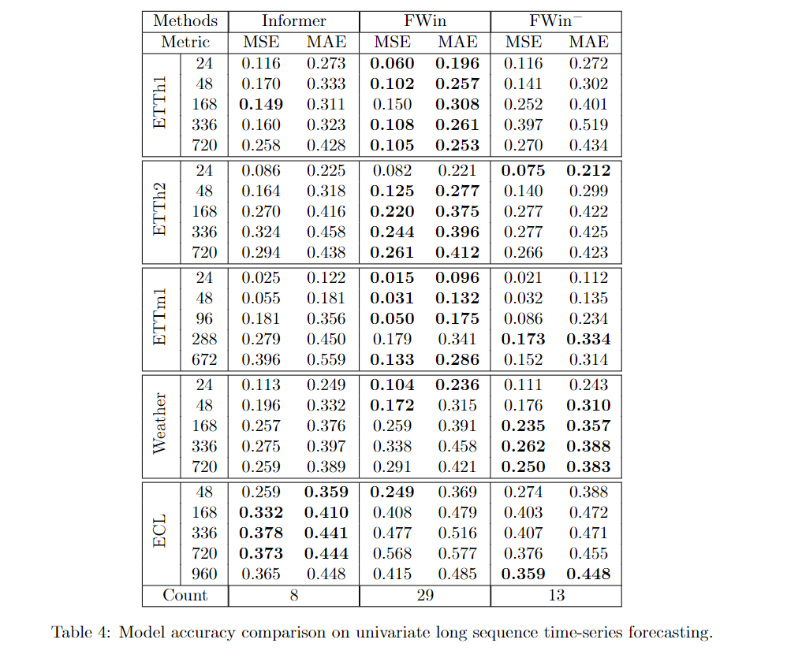
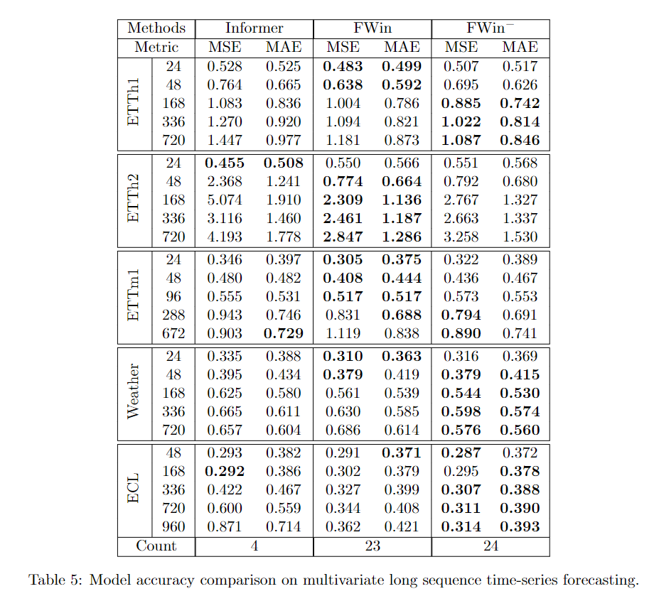

# FWin Transformer (2023)

Nhat Thanh Tran, Jack Xin: Fourier-Mixed Window Attention: Accelerating Informer for Long Sequence Time-Series Forecasting

Fourier Mix Window Attention (FWin) Transformer is a modification of Informer. It is faster than Informer and slightly improve prediction.

FWin model overview: 

||
|:--:|
| *Figure 1. FWin Model Overview* |

Main Results
||
|:--:|
| *Figure 2. Univariate* |

||
|:--:|
| *Figure 3. Multivariate* |
## Requirements

- Python 3.9
- matplotlib == 3.1.1
- numpy == 1.19.4
- pandas == 0.25.1
- scikit_learn == 0.21.3
- torch == 2.0.0

Dependencies can be installed using the following command:
```bash
pip install -r requirements.txt
```
## Data

The data can be dowloaded from [[here](https://drive.google.com/drive/folders/1ZOYpTUa82_jCcxIdTmyr0LXQfvaM9vIy)]

## Reproducibility

To easily reproduce the results you can follow the next steps:
1. Initialize the docker image using: `make init`.
2. Download the datasets using: `make dataset`.
3. Run each script in `scripts/` using `make run_module module="bash ETTh1.sh"` for each script.
4. Alternatively, run all the scripts at once:
```
for file in `ls scripts`; do make run_module module="bash scripts/$script"; done
```
## Acknowledgement

We appreciate the following github repos a lot for their valuable code base or datasets:

https://github.com/zhouhaoyi/Informer2020

https://github.com/MAZiqing/FEDformer

https://github.com/thuml/Autoformer

https://github.com/laiguokun/multivariate-time-series-data

https://github.com/salesforce/ETSformer
