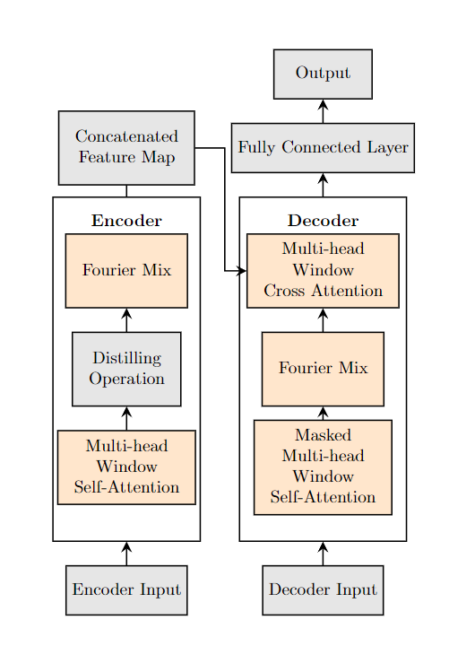

# FWin Transformer (2023)

Nhat Thanh Tran, Jack Xin: Fourier-Mixed Window Attention: Accelerating Informer for Long Sequence Time-Series Forecasting

Fourier Mix Window Attention (FWin) Transformer is a modification of Informer. It is faster than Informer and slightly improve prediction.

FWin model overview: 
<div style="text-align:center">
  
</div>
## Requirements

- Python 3.6
- matplotlib == 3.1.1
- numpy == 1.19.4
- pandas == 0.25.1
- scikit_learn == 0.21.3
- torch == 1.8.0

Dependencies can be installed using the following command:
```bash
pip install -r requirements.txt
```

## Data

The ETT dataset used in the paper can be downloaded in the repo [ETDataset](https://github.com/zhouhaoyi/ETDataset).
The required data files should be put into `data/ETT/` folder. A demo slice of the ETT data is illustrated in the following figure. Note that the input of each dataset is zero-mean normalized in this implementation.

The ECL data and Weather data can be downloaded here.
- [Google Drive](https://drive.google.com/drive/folders/1ohGYWWohJlOlb2gsGTeEq3Wii2egnEPR?usp=sharing)
- [BaiduPan](https://pan.baidu.com/s/1wyaGUisUICYHnfkZzWCwyA), password: 6gan 

## Reproducibility

To easily reproduce the results you can follow the next steps:
1. Initialize the docker image using: `make init`.
2. Download the datasets using: `make dataset`.
3. Run each script in `scripts/` using `make run_module module="bash ETTh1.sh"` for each script.
4. Alternatively, run all the scripts at once:
```
for file in `ls scripts`; do make run_module module="bash scripts/$script"; done
```
## Acknowledgement

We appreciate the following github repos a lot for their valuable code base or datasets:
https://github.com/zhouhaoyi/Informer2020
